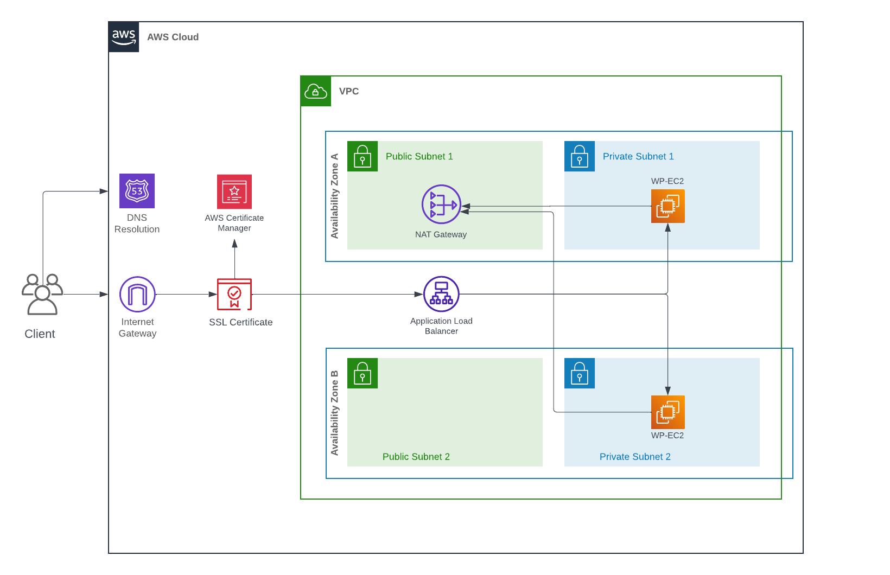

# **Serene Laser Studio: WordPress Website Infrastructure with Terraform**

## **Overview**

This project automates the deployment of a highly available WordPress website infrastructure for **Serene Laser Studio** (https://serene-laserstudio.com), a company specializing in diode laser hair removal. The infrastructure is deployed on **AWS** using **Terraform**, leveraging a **golden AMI**, **VPC** networking, and an **Application Load Balancer (ALB)** to provide scalability and reliability.

---

## **Infrastructure Diagram**




---

## **Features**

- **Custom VPC Setup**: Includes public and private subnets in two availability zones.
- **Private WordPress Web Servers**: Two EC2 instances running WordPress, deployed in private subnets.
- **Application Load Balancer (ALB)**: Placed in public subnets, forwarding HTTPS traffic to the WordPress instances.
- **Golden AMI**: Pre-configured WordPress instance for consistent and rapid deployment.
- **Network Configuration**:
  - NAT Gateway for outbound internet traffic from private subnets.
  - Internet Gateway for public subnets.
- **TLS/SSL Encryption**:
  - ACM-provided SSL certificate for secure HTTPS connections.
  - ALB configured to handle HTTPS.
- **Domain and DNS**:
  - Domain registration and DNS management via Route 53.
  - ALB set as the alias target for the domain's A record.
- **Sensitive Data Management**:
  - Variables stored in `variables.tfvars` for secure handling of sensitive information.

---

## **Manual Configurations**

Some components were manually configured outside Terraform due to constraints:

1. **Route 53**:
   - Domain registration.
   - Hosted Zone setup.
2. **ACM**:
   - Certificate issuance for the domain using AWS Certificate Manager (ACM).

---

## **Prerequisites**

1. **AWS Account** with:
   - ACM Certificate issued for your domain.
   - Route 53 Hosted Zone for the domain.
2. **Terraform CLI** installed locally.
3. **RSA Key Pair** for SSH access to the EC2 instances.
4. Properly configured **AWS credentials**.

---

## **File Structure**

```
terraform_serene/
├── main.tf                         # Main Terraform configuration file
├── outputs.tf                      # Output variables from Terraform configuration
├── terraform.tfvars                # Contains sensitive variables and secrets
├── variables.tf                    # Definitions of variable types
├── .gitignore                      # Git ignore rules to exclude files like state and sensitive data
├── README.md                       # Project documentation
└── wordpress-architecture-diagram.png  # Diagram of the architecture (link it below in README)
```

## Deployment Steps

1. **Clone the Repository**
    ```bash
    git clone https://github.com/JcPrince28/terraform_serene.git
    cd terraform_serene
    ```
	
2. **Install Terraform**
    Ensure Terraform is installed and available in your system's PATH.
    [Download Terraform](https://www.terraform.io/downloads)

3. **Set Up AWS CLI and Configure Credentials**
    Ensure that the AWS CLI is configured with the correct credentials:
    ```bash
    aws configure
    ```

4. **Customize Variables**
    Declare variable values by creating/modifying the `terraform.tfvars` file. Specifically, ensure that:
    - `aws_region` is set to your desired AWS region.
    - `vpc_cidr`, `private_cidr`, and `public_cidr` match your network configuration.
    - `certificate_arn` is set to the ARN of the ACM certificate you created.
	- `aws_account_id`
	- `public_zone_id`
	
5. **Access the Webserver**
    - The EC2 instances will be deployed in private subnets without public IP addresses but connected to a NAT gateway for outbound internet access.
    - You can connect to the EC2 instances using SSH via a bastion host or VPN, if configured.

## Additional Information

- **Network Diagram**: A visual representation of the infrastructure is available in the `wordpress-architecture-diagram.png` file.

## **GitHub Actions Workflow Secrets Configuration**

To deploy your Terraform infrastructure to AWS using GitHub Actions, you'll need to configure the following secrets in your GitHub repository:

### **Required Secrets**
You can configure these secrets in the GitHub repository by going to **Settings > Secrets and Variables > Actions**.

- **`AWS_ACCESS_KEY_ID`**: Your AWS access key ID for authentication.
- **`AWS_SECRET_ACCESS_KEY`**: Your AWS secret access key for authentication.
- **`AWS_REGION`**: The AWS region where your infrastructure will be deployed (e.g., `us-west-2`).
- **`VPC_CIDR`**: The CIDR block for the VPC.
- **`SUBNET_CIDR`**: The CIDR block for the subnet.
- **`PUBLIC_CIDR`**: The CIDR block for the public subnet.
- **`PUBLIC_CIDR2`**: Additional CIDR block for a second public subnet.
- **`PRIVATE_CIDR`**: The CIDR block for the private subnet.
- **`PRIVATE_CIDR2`**: Additional CIDR block for a second private subnet.
- **`VPC_NAME`**: Name of the VPC.
- **`CERTIFICATE_ARN`**: ARN of the SSL certificate issued via AWS ACM.
- **`AWS_ACCOUNT_ID`**: Your AWS account ID.
- **`PUBLIC_ZONE_ID`**: The Route 53 hosted zone ID for your domain.

### **Configuring the GitHub Actions Workflow**
In the `terraform_serene` repository, a GitHub Actions workflow is used to automate the deployment of Terraform configurations to AWS. This workflow requires the above secrets to be set as environment variables in order to authenticate with AWS and configure the infrastructure.

---

### **Example GitHub Actions Workflow:**
Here is an example section of the GitHub Actions YAML file that uses the secrets:

```yaml
terraform-apply:
  needs: terraform-validation
  runs-on: ubuntu-latest
  env:
    AWS_ACCESS_KEY_ID: ${{ secrets.AWS_ACCESS_KEY_ID }}
    AWS_SECRET_ACCESS_KEY: ${{ secrets.AWS_SECRET_ACCESS_KEY }}
    TF_VAR_aws_region: ${{ secrets.AWS_REGION }}
    TF_VAR_vpc_cidr: ${{ secrets.VPC_CIDR }}
    TF_VAR_subnet_cidr: ${{ secrets.SUBNET_CIDR }}
    TF_VAR_public_cidr: ${{ secrets.PUBLIC_CIDR }}
    TF_VAR_public_cidr2: ${{ secrets.PUBLIC_CIDR2 }}
    TF_VAR_private_cidr: ${{ secrets.PRIVATE_CIDR }}
    TF_VAR_private_cidr2: ${{ secrets.PRIVATE_CIDR2 }}
    TF_VAR_vpc_name: ${{ secrets.VPC_NAME }}
    TF_VAR_certificate_arn: ${{ secrets.CERTIFICATE_ARN }}
    TF_VAR_aws_account_id: ${{ secrets.AWS_ACCOUNT_ID }}
    TF_VAR_public_zone_id: ${{ secrets.PUBLIC_ZONE_ID }}
```
