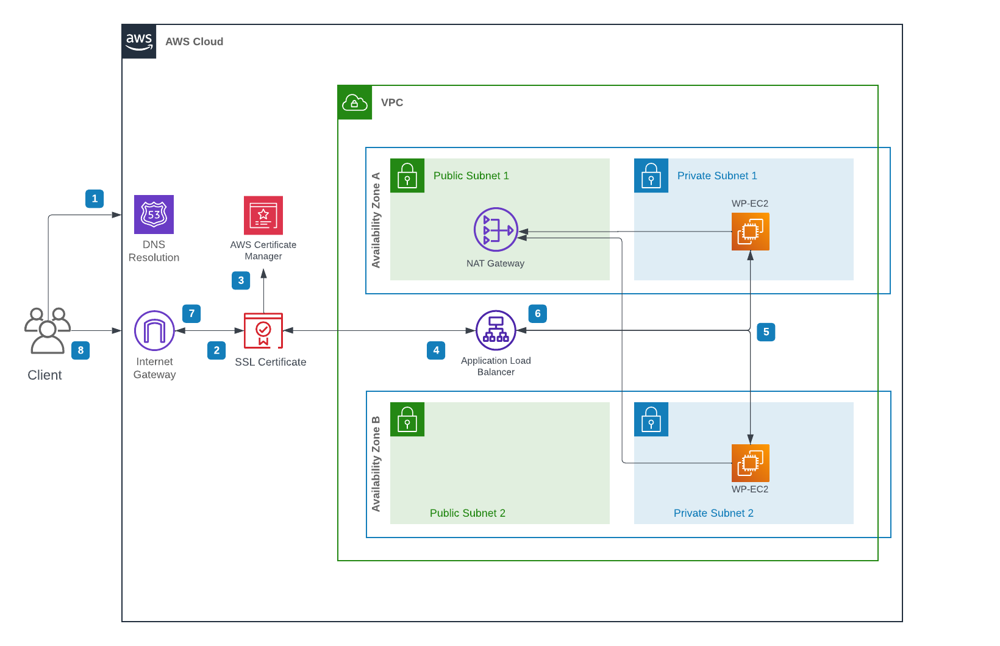

# **Serene Laser Studio: WordPress Website Infrastructure with Terraform**

## **Overview**

This project automates the deployment of a highly available WordPress website infrastructure for **Serene Laser Studio**, a company specializing in diode laser hair removal. The infrastructure is deployed on **AWS** using **Terraform**, leveraging a **golden AMI**, **VPC** networking, and an **Application Load Balancer (ALB)** to provide scalability and reliability.

---

## **Features**

- **Custom VPC Setup**: Includes public and private subnets in two availability zones.
- **Private WordPress Web Servers**: Two EC2 instances running WordPress, deployed in private subnets.
- **Application Load Balancer (ALB)**: Placed in public subnets, forwarding HTTPS traffic to the WordPress instances.
- **Golden AMI**: Pre-configured WordPress instance for consistent and rapid deployment.
- **Network Configuration**:
  - NAT Gateway for outbound internet traffic from private subnets.
  - Internet Gateway for public subnets.
- **TLS/SSL Encryption**:
  - ACM-provided SSL certificate for secure HTTPS connections.
  - ALB configured to handle HTTPS.
- **Domain and DNS**:
  - Domain registration and DNS management via Route 53.
  - ALB set as the alias target for the domain's A record.
- **Sensitive Data Management**:
  - Variables stored in `variables.tfvars` for secure handling of sensitive information.

---

## **Manual Configurations**

Some components were manually configured outside Terraform due to constraints:

1. **Route 53**:
   - Domain registration.
   - Hosted Zone setup.
   - A record pointing to the ALB alias.
2. **ACM**:
   - Certificate issuance for the domain using AWS Certificate Manager (ACM).

---

## **Infrastructure Diagram**



---

## **Prerequisites**

1. **AWS Account** with:
   - ACM Certificate issued for your domain.
   - Route 53 Hosted Zone for the domain.
2. **Terraform CLI** installed locally.
3. **RSA Key Pair** for SSH access to the EC2 instances.
4. Properly configured **AWS credentials**.

---

## **File Structure**

.
├── main.tf                        # Main Terraform configuration file
├── variables.tf                   # Variable definitions for Terraform
├── variables.tfvars               # Variable values for sensitive or environment-specific data
├── outputs.tf                     # Output definitions for Terraform
├── .gitignore                     # Git ignore file to exclude sensitive and generated files
├── README.md                      # Project documentation
└── wordpress-architecture-diagram.png # AWS Infrastructure network diagram


## Deployment Steps

1. **Clone the Repository**
    ```bash
    git clone <your-repository-url>
    cd <your-repository-folder>
    ```

2. **Install Terraform**
    Ensure Terraform is installed and available in your system's PATH.
    [Download Terraform](https://www.terraform.io/downloads)

3. **Set Up AWS CLI and Configure Credentials**
    Ensure that the AWS CLI is configured with the correct credentials:
    ```bash
    aws configure
    ```

4. **Customize Variables (optional)**
    You may customize some of the variable values by creating/modifying the `terraform.tfvars` file. Specifically, ensure that:
    - `aws_region` is set to your desired AWS region.
    - `vpc_cidr`, `private_cidr`, and `public_cidr` match your network configuration.
    - `certificate_arn` is set to the ARN of the ACM certificate you created.
	
5. **Access the Webserver**
    - The EC2 instances will be deployed in private subnets without public IP addresses.
    - You can connect to the EC2 instances using SSH via a bastion host or VPN, if configured.

## Additional Information

- **Network Diagram**: A visual representation of the infrastructure is available in the `wordpress-architecture-diagram.png` file.
